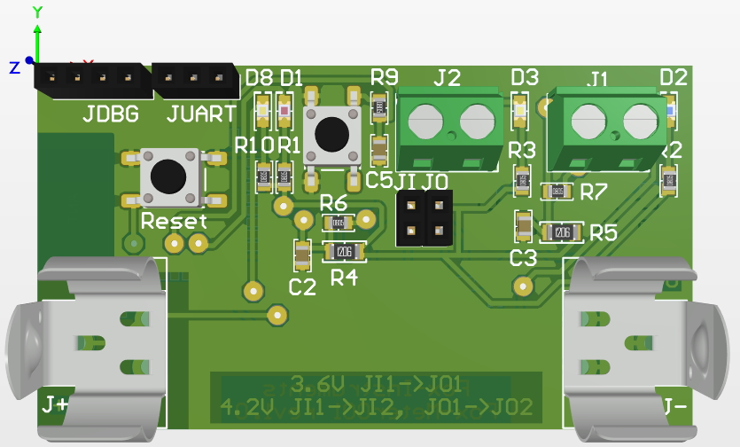
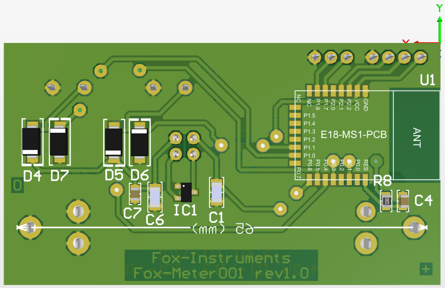

# WaterMeter PCB

Designed in Altium designer. 
[PCB PDF file](PCB_Water_meter_device.pdf) - Top and bottom layers for the production of printed circuit boards using laser-ironing technology.

PCB is modified to deliver the convenience of DIY manufacturing. VIAs size are increased. Sights are added to perform centering top and bottom layers. All pads with holes have centering dots to positioning the drill.

# Schematic
[Schematic PDF file](WaterMeterSchematic.pdf)

# Power source
User can use LiFePO4 or Li-Ion accumalator.

If LiFePO4 than **JI** and **JO** pins 1 should be connected to exclude LDO 3.6V and supply device directly from accumulator

If Li-Ion than jumpers **JI** and **JO** should be installed to use LDO 3.6V

# Connectivity

**J1** - Inpit 1 
**J2** - Inpit 2 
**JUART** - UART 
**JDBG** - DEBUG 

# LEDs and Keys

**LED D1** - Green, Device working mode 
**LED D2** - Blue, Input 1 
**LED D3** - Red, Input 2 
**LED D8** - Spare 
**Key1** - Select device working mode 
**Key2** - Reboot device

LED3 state    | Key1 state  | Device mode
--------------|-------------|--
Light  | Key1 pressed and released | Device active for 2 minutes
Blink 500ms | Key1 pressed more than 5sec | Comissioning mode 
Blink 200ms | Key1 pressed more than 10sec | Device factory reset
