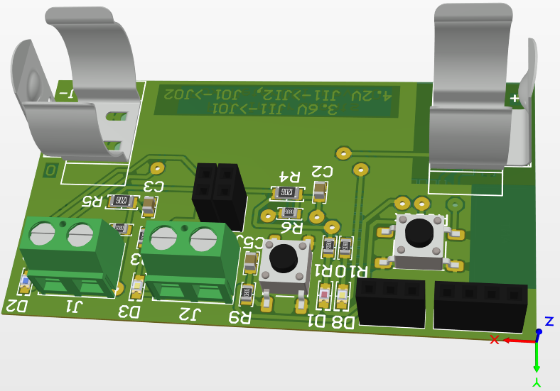
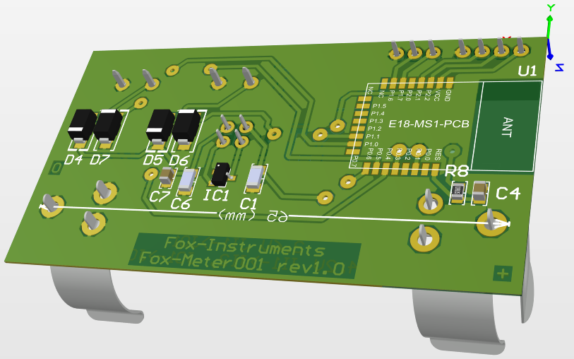
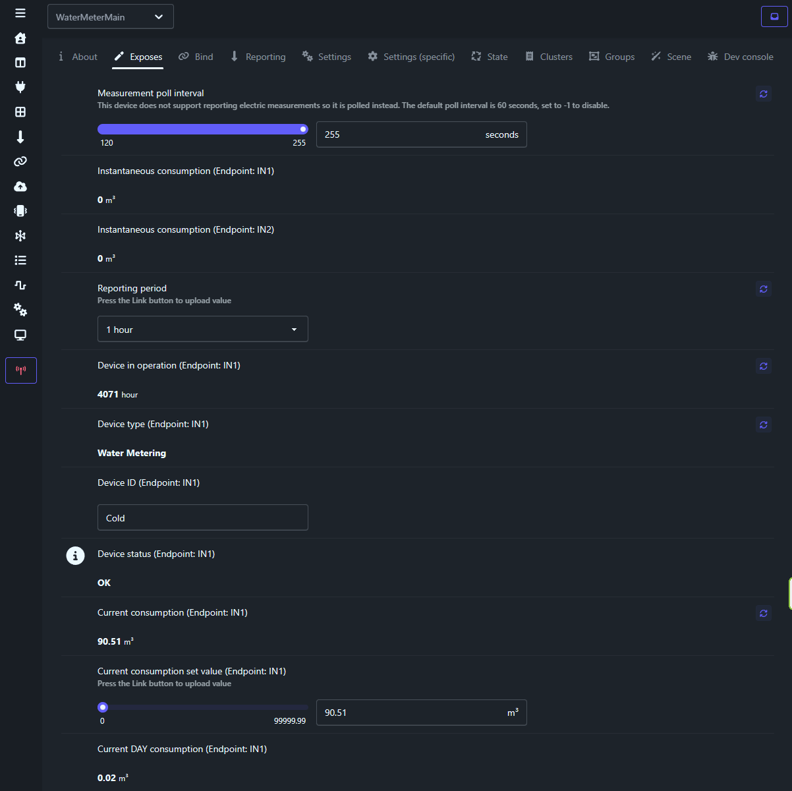

# WaterMeter Texas Intruments CC2530 Zigbee device
Long life LiFePO4 or LiIon powered Zigbee device to read Water Flow from meters with dry contact output.

## Specification
* Controller: CC2530
* Dry contact inputs: 2
* Power: LiFePO4 or LiIon accumulator
* Power consumption: Active ~ 25-30 mA, Sleep mode < 6 uA
* 4 LEDs: Active mode, Input 1, Input 2, Spare
* 2 Buttons: Control, Reset
* Home Assistant Z2M integration (z2m-external-converter)
* Home Assistant app Telegram Bot to send monthly report 

## Build firmware
* IAR Embedded Workbench for 8051
* SDK TI Z-Stack v3.0.2

## PCB
PCB designed in Altium Designer. View [PCB folder](./PCB/) for more details.

# Home Assistant device configuration and monitoring

